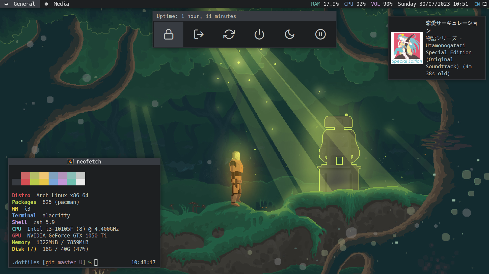

<h1 align="center"> ❤ ~/.dotfiles</h1>

## Details

- GUI
  - [awesomewm](https://github.com/awesomeWM/awesome) - A highly configurable, next generation framework window manager for X.
  - [i3wm](https://github.com/i3/i3) - A tiling window manager.
    - [Dunst](https://github.com/dunst-project/dunst) - A highly configurable and lightweight notification daemon.
  - [LightDM](https://github.com/canonical/lightdm) - LightDM is a cross-desktop display manager.
    - [LightDM GTK Greeter](https://github.com/Xubuntu/lightdm-gtk-greeter) - A greeter that has moderate requirements (GTK).
  - [Alacritty](https://github.com/alacritty/alacritty) - A cross-platform, GPU-accelerated terminal emulator.
  - [Rofi](https://github.com/davatorium/rofi) - A window switcher, application launcher and dmenu replacement.
    - [Rofi collection](https://github.com/adi1090x/rofi) - A huge collection of Rofi based custom Applets, Launchers & Powermenus..
  - [picom](https://github.com/yshui/picom) - A lightweight compositor for X11.
  - [Conky](https://github.com/brndnmtthws/conky) - Light-weight system monitor for X, that displays any kind of information on your desktop.
  - [nitrogen](https://github.com/l3ib/nitrogen) - Background browser and setter for X windows.
  - [pavucontrol](https://freedesktop.org/software/pulseaudio/pavucontrol/) - PulseAudio Volume Control.
  - [Mpv](https://mpv.io/) - A free, open source, and cross-platform media player.
  - [Viewnior](https://siyanpanayotov.com/project/viewnior) - Fast and elegant image viewer.
  - [Nemo](https://github.com/linuxmint/nemo) - Nemo is the file manager.
  - [Thunderbird](https://www.thunderbird.net/) - Thunderbird is a free email application that's easy to set up and customize - and it's loaded with great features.
  - [IBus](https://github.com/ibus/ibus/wiki) - Next Generation Input Bus for Linux.
  - [Zathura](https://pwmt.org/projects/zathura/) - A highly customizable and functional document viewer.
  - [network-manager-applet](https://gitlab.gnome.org/GNOME/network-manager-applet) - Tray applet and an advanced network connection editor.
  - [system-config-printer](https://github.com/OpenPrinting/system-config-printer) - A CUPS printer configuration tool and status applet.
  - [simple-scan](https://gitlab.gnome.org/GNOME/simple-scan) - Simple scanning utility.
- CLI
  - [yay](https://github.com/Jguer/yay) - Yet Another Yogurt - An AUR Helper Written in Go.
  - [zsh](https://github.com/zsh-users/zsh) - A shell designed for interactive use, although it is also a powerful scripting language.
  - [tmux](https://github.com/tmux/tmux) - A terminal multiplexer.
  - [nvim](https://github.com/neovim/neovim) - Hyperextensible Vim-based text editor.
    - [mason.nvim](https://github.com/williamboman/mason.nvim) - Easily install and manage LSP servers, DAP servers, linters, and formatters.
    - [nvim-treesitter](https://github.com/nvim-treesitter/nvim-treesitter) - A parser generator tool and an incremental parsing library.
    - [nvim-tree.lua](https://github.com/nvim-tree/nvim-tree.lua) - A File Explorer For Neovim Written In Lua.
    - [bufferline.nvim](https://github.com/nvim-tree/nvim-tree.lua) - A snazzy nail_care buffer line (with tabpage integration) for Neovim built using lua.
    - [lualine.nvim](https://github.com/nvim-lualine/lualine.nvim) - A blazing fast and easy to configure Neovim statusline written in Lua.
    - [telescope.nvim](https://github.com/nvim-telescope/telescope.nvim) - Find, Filter, Preview, Pick. All lua, all the time.
    - [nvim-cmp](https://github.com/hrsh7th/nvim-cmp) - A completion engine plugin for neovim written in Lua.
    - [tokyonight.nvim](https://github.com/folke/tokyonight.nvim) - A dark and light Neovim theme written in Lua.
    - [which-key.nvim](https://github.com/folke/which-key.nvim) - Displays a popup with possible keybindings of the command you started typing.
  - [tig](https://github.com/jonas/tig) - Text-mode interface for Git.
  - [htop](https://github.com/htop-dev/htop) - An interactive process viewer.
  - [ranger](https://github.com/ranger/ranger) - Ranger is a console file manager with VI key bindings.
  - [lsd](https://github.com/Peltoche/lsd) - GNU ls with lots of added features like colors, icons, tree-view, more formatting options etc.
  - [fzf](https://github.com/junegunn/fzf) - A command-line fuzzy finder.
  - [ripgrep](https://github.com/BurntSushi/ripgrep) - A line-oriented search tool that recursively searches directories for a regex pattern.
  - [cava](https://github.com/karlstav/cava) - Cross-platform Audio Visualizer.
  - [cmatrix](https://github.com/abishekvashok/cmatrix) - Matrix like effect in your terminal.
  - [pipes.sh](https://github.com/pipeseroni/pipes.sh) - Animated pipes terminal screensaver.
  - [mpd](https://github.com/MusicPlayerDaemon/MPD) - A flexible, powerful, server-side application for playing music.
    - [ncmpcpp](https://github.com/ncmpcpp/ncmpcpp) - Featureful ncurses based MPD client inspired by ncmpc.
  - [playerctl](https://github.com/altdesktop/playerctl) - For true players only: vlc, mpv, RhythmBox, web browsers, cmus, mpd, spotify and others.
  - [colorscript](https://gitlab.com/dwt1/shell-color-scripts) - A collection of terminal color scripts.

## Install and setup

Dual boot Windows 10 and Arch linux [here](./docs/DUAL.md)

Setup for Arch [here](./docs/SETUP.md)
