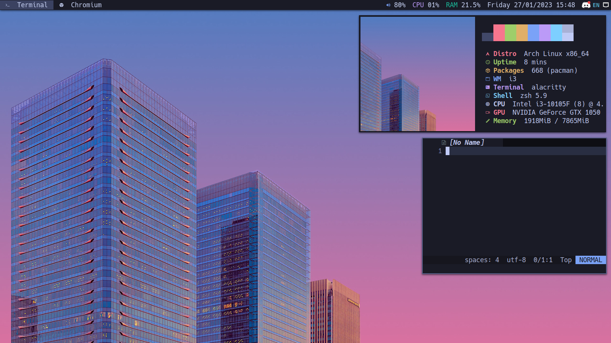

<h1 align="center">dotfiles ❤ ~/</h1>

    <b>Screenshots</b> 
    <a href="">Rofi</a>&nbsp;&nbsp;&nbsp;
    <a href="">Dunst</a>&nbsp;&nbsp;&nbsp;
    <a href="">Zsh</a>&nbsp;&nbsp;&nbsp;
    <a href="">tmux</a>&nbsp;&nbsp;&nbsp;

## Details

- GUI
  - [i3](https://github.com/i3/i3) - A tiling window manager.
  - [Alacritty](https://github.com/alacritty/alacritty) - A cross-platform, GPU-accelerated terminal emulator.
  - [Rofi](https://github.com/davatorium/rofi) - A window switcher, application launcher and dmenu replacement.
    - [Rofi](https://github.com/adi1090x/rofi) - A huge collection of Rofi based custom Applets, Launchers & Powermenus..
  - [Dunst](https://github.com/dunst-project/dunst) - A highly configurable and lightweight notification daemon.
  - [picom](https://github.com/yshui/picom) - A lightweight compositor for X11.
  - [conky](https://github.com/brndnmtthws/conky) - Light-weight system monitor for X, that displays any kind of information on your desktop.
  - [Feh](https://feh.finalrewind.org/) - Wallpaper.
- CLI
  - [Zsh](https://github.com/zsh-users/zsh) - A shell designed for interactive use, although it is also a powerful scripting language.
    - [z](https://github.com/rupa/z) - Tracks your most used directories, based on frecency.
  - [tmux](https://github.com/tmux/tmux) - A terminal multiplexer.
  - [Neovim](https://github.com/neovim/neovim) - Hyperextensible Vim-based text editor.
    - [mason.nvim](https://github.com/williamboman/mason.nvim) - Easily install and manage LSP servers, DAP servers, linters, and formatters.
    - [nvim-treesitter](https://github.com/nvim-treesitter/nvim-treesitter) - A parser generator tool and an incremental parsing library.
    - [nvim-tree.lua](https://github.com/nvim-tree/nvim-tree.lua) - A File Explorer For Neovim Written In Lua.
    - [bufferline.nvim](https://github.com/nvim-tree/nvim-tree.lua) - A snazzy nail_care buffer line (with tabpage integration) for Neovim built using lua.
    - [lualine.nvim](https://github.com/nvim-lualine/lualine.nvim) - A blazing fast and easy to configure Neovim statusline written in Lua.
    - [telescope.nvim](https://github.com/nvim-telescope/telescope.nvim) - Find, Filter, Preview, Pick. All lua, all the time.
    - [nvim-cmp](https://github.com/hrsh7th/nvim-cmp) - A completion engine plugin for neovim written in Lua.
    - [tokyonight.nvim](https://github.com/folke/tokyonight.nvim) - A dark and light Neovim theme written in Lua.
    - [which-key.nvim](https://github.com/folke/which-key.nvim) - Displays a popup with possible keybindings of the command you started typing.
  - [tig](https://github.com/jonas/tig) - Text-mode interface for Git.
  - [htop](https://github.com/htop-dev/htop) - An interactive process viewer.
  - [LSD](https://github.com/Peltoche/lsd) - GNU ls with lots of added features like colors, icons, tree-view, more formatting options etc.
  - [fzf](https://github.com/junegunn/fzf) - A command-line fuzzy finder.
  - [ripgrep](https://github.com/BurntSushi/ripgrep) - A line-oriented search tool that recursively searches directories for a regex pattern.
  - [colorscript](https://gitlab.com/dwt1/shell-color-scripts) - A collection of terminal color scripts.

## Setup

Install [OS](./Markdowns/OS.md)

Install [GUI](./Markdowns/GUI.md)

Install [CLI](./Markdowns/CLI.md)
