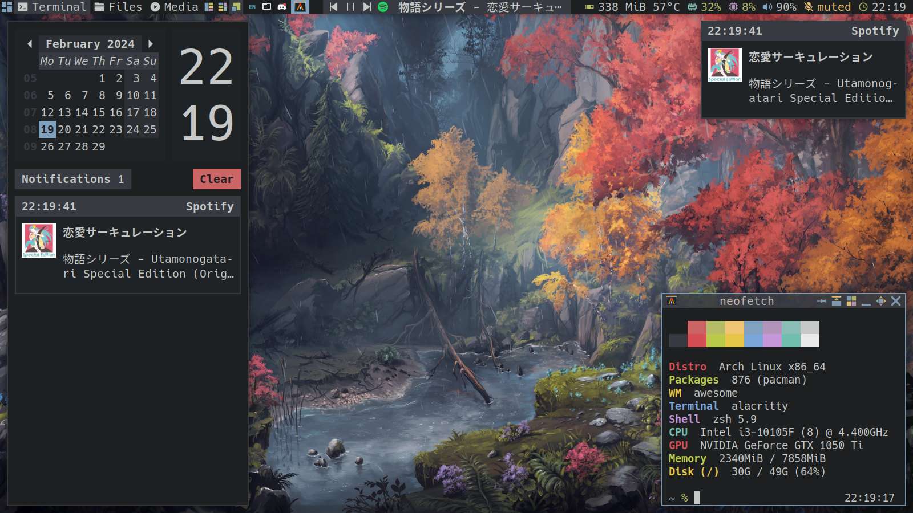
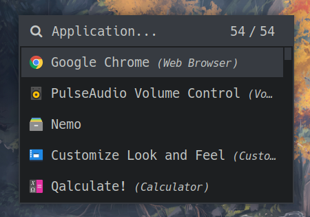

# ❤ ~/.dotfiles

This repository contains my personal Linux configuration files.

## Introduction

Here are some details about my setup:

|   **Distro**   |                     Arch Linux                      |
| :------------: | :-------------------------------------------------: |
|     **WM**     |  [Awesome](https://github.com/awesomeWM/awesome/)   |
| **Compositor** |       [Picom](https://github.com/yshui/picom)       |
|  **Launcher**  |     [Rofi](https://github.com/davatorium/rofi/)     |
|  **Terminal**  | [Alacritty](https://github.com/alacritty/alacritty) |
|   **Shell**    |             [Zsh](https://www.zsh.org/)             |
|   **Editor**   |     [Neovim](https://github.com/neovim/neovim/)     |

## Gallery

Awesome

 

 

Launcher

 

 

## Setup

Dual boot Windows 10 and Arch Linux [here](./docs/DUAL.md)

Setup for Arch Linux [here](./docs/SETUP.md)

